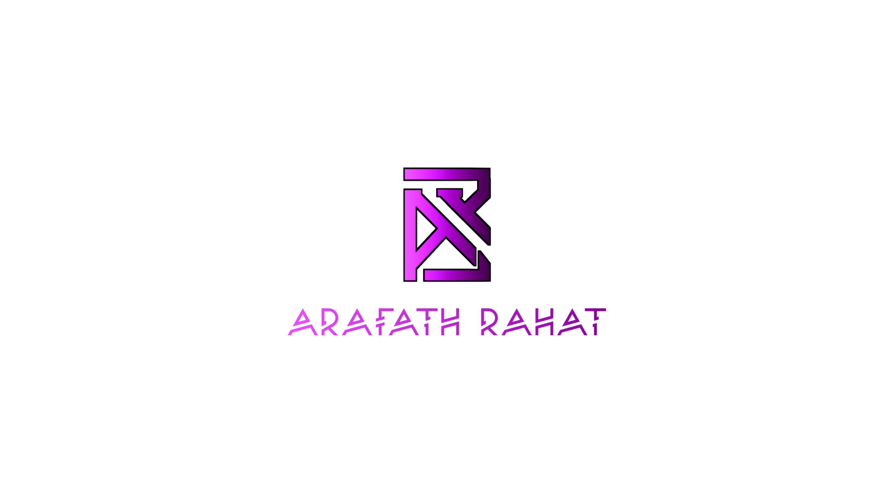

  

I'm a Software Developer based in Bangladesh.

Self-driven, focused, and dedicated Web Developer. I am passionate about programming, developing new products, and exploring new technologies. Well-versed in modern web technologies and version control systems. Slow-paced learner, a good team player, and committed to achieving the goal. Determined to deliver quality with an emphasis on excellence.

 

## 🚀 <b>TECH STACK</b>

    

        <b>Languages</b>
    

-   <small>JavaScript (ES6+)</small>
     

    

        <b>Front End</b>
    

-   <small>HTML5</small>
     
-   <small>CSS3</small>
     
-   <small>React JS</small>
     
-   <small>Next JS</small>
     
-   <small>Tailwind CSS</small>

    

        <b>Back End</b>
    

-   <small>Node JS</small>
     
-   <small>Express JS</small>

    

        <b>Database</b>
    

-   <small>MongoDB</small>

    

        <b>User Management</b>
    

-   <small>Firebase Auth</small>
     
-   <small>JWT</small>

    

        <b>JavaScript Components</b>
    

-   <small>React Router</small>

    

        <b>Version Control</b>
    

-   <small>Git</small>
     
-   <small>GitHub</small>

 

  
## 🧊 <b>PROJECTS</b>

|     | NAME                                           | GITHUB <small>[CLIENT]</small>                                          | GITHUB <small>[SERVER]</small>                                          | TYPE       | COLLABORATION |
| --- | ---------------------------------------------- | ----------------------------------------------------------------------- | ----------------------------------------------------------------------- | ---------- | ------------- |
| 1   | [FoodHut](https://foodhut-7556c.web.app/) | [food-hut-client](https://github.com/arafatrahat94/food-hut) | [foodhut-server](https://github.com/arafatrahat94/foodhut-server) | Full-Stack | Solo          |
| 2   | [Doc House](https://doc-house-xi.vercel.app/)     | [doc-house-client](https://github.com/arafatrahat94/doc-house)       | [doc-house-server]()       | Full-Stack | Solo          |

 
## 🗨️ <b>CONTACT</b>

[<b>Email</b>](mailto:arafatrahat94@gmail.com) <b>|</b> [<b>LinkedIn</b>](https://www.linkedin.com/in/MdArafathHossain) <b>|</b> [<b>Facebook</b>](https://fb.com/md.arafathhossainrahat) <b>|</b> [<b>Instagram</b>](https://www.instagram.com/md.arafathhossainrahat) <b>|</b> [<b>WHatsApp</b>](https://wa.me/+8801980389400) <b>|</b> [<b>Resume</b>](https://arafathhossain.vercel.app/Resume)

 

## 🌐 <b>PORTFOLIO</b>

[<b>ArafatHossain.app</b>](https://arafathhossain.vercel.app/)

 
